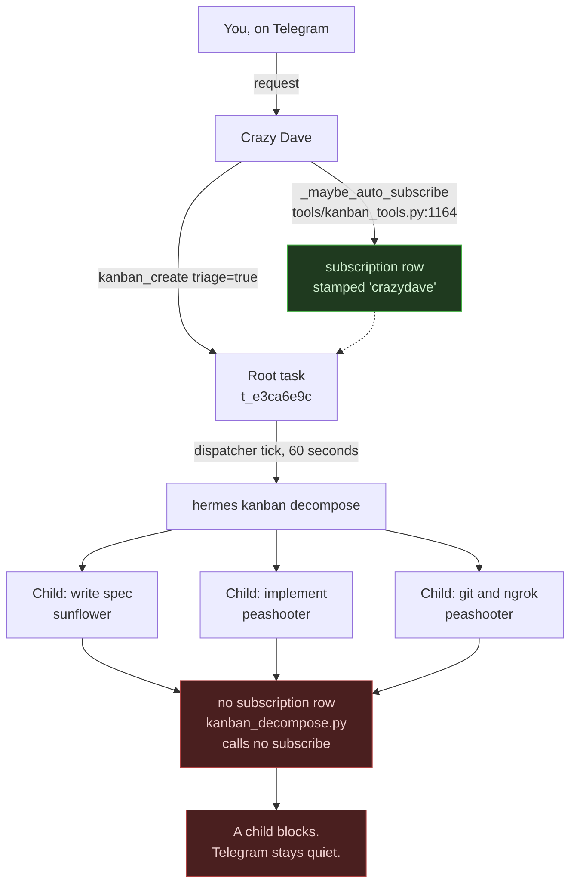
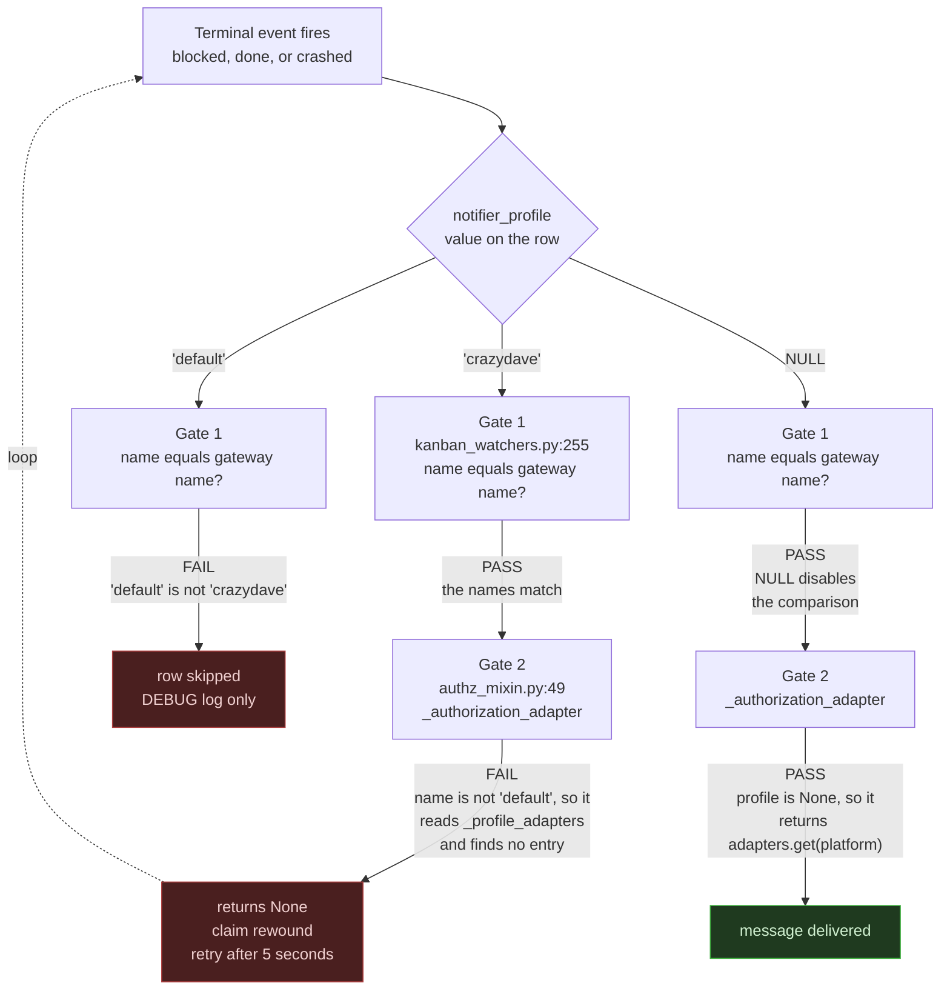
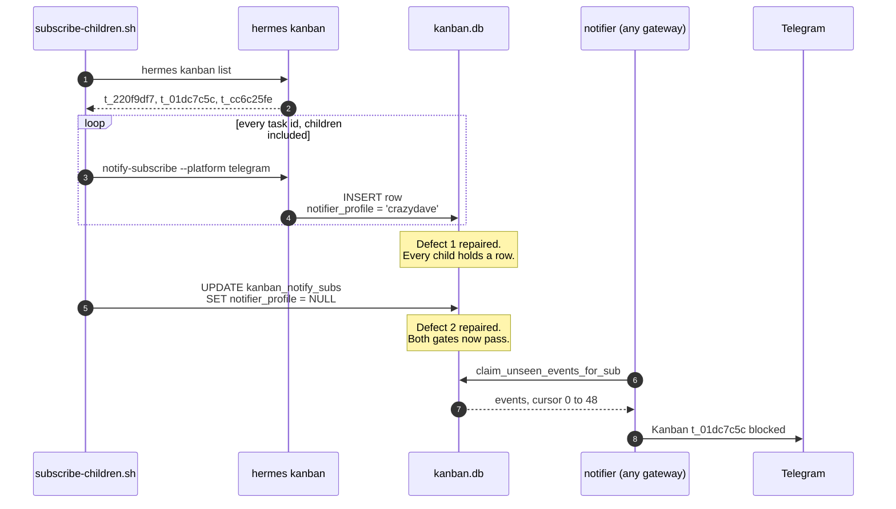
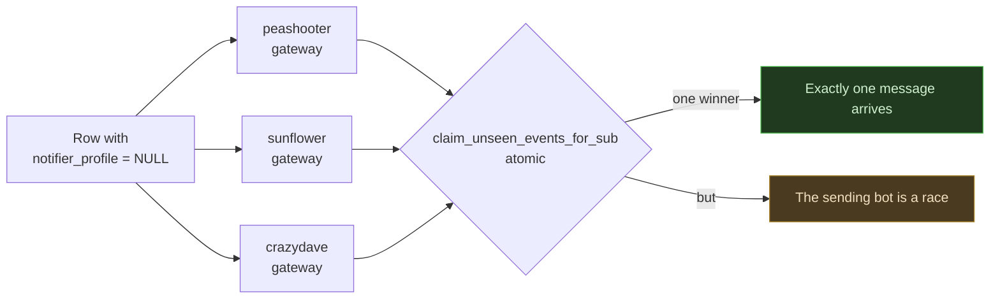
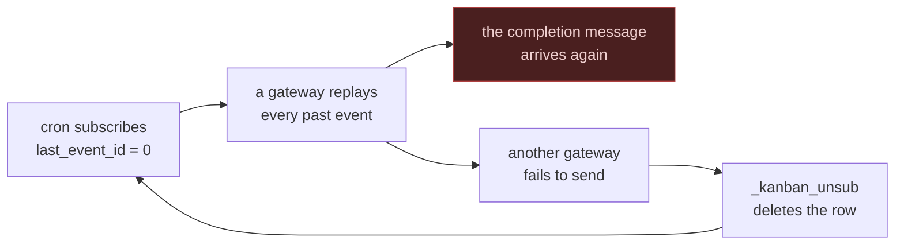

# Why `subscribe-children.sh` exists

> **Superseded on 2026-09-09.** The scripts this document describes are
> deleted. The cron repair created a message loop that ran for six hours. See
> [learning record 0010](../learning-records/0010-a-fix-that-amplified-the-defect.md)
> and [Lesson 17](../lessons/0017-workers-report-their-own-results.html).
> Stage 2 now reports through `hermes send`, called by the worker that did the
> job. Keep this page for the defect analysis, not for the repair.


Two separate defects stop kanban notifications from reaching Telegram. One
defect creates no subscription row. The other defect blocks delivery on the
rows that do exist. The script `hermes-config/subscribe-children.sh` repairs
both defects in one run.

Related learning record:
[0008-blocked-child-tasks-report-to-nobody](../learning-records/0008-blocked-child-tasks-report-to-nobody.md)

---

## Defect 1 — the children have no subscription

Crazy Dave creates one root task and subscribes that root task. The
dispatcher then splits the root into children. The split creates no
subscription for any child.

The subscribe call lives in `_maybe_auto_subscribe` at
`tools/kanban_tools.py:1164`. That function runs on the `kanban_create` tool
path only. The file `hermes_cli/kanban_decompose.py` contains zero references
to `subscribe`.

The specialists do all real work inside the children. Telegram watches the
root only.



Evidence from a real run:

```
t_e3ca6e9c  root       -> subscribed
t_220f9df7  write spec -> no row
t_01dc7c5c  implement  -> no row
t_cc6c25fe  git+ngrok  -> no row
```

Task `t_01dc7c5c` blocked at 23:53. No message arrived.

The setting `kanban.auto_subscribe_on_create` at `hermes_cli/config.py:1503`
defaults to `True`. That setting covers the create path only. No
configuration value makes `decompose` subscribe a child.

---

## Defect 2 — the profile stamp blocks delivery

The notifier applies two gates to every subscription row. The two gates
reject opposite values.

Gate 1 sits at `gateway/kanban_watchers.py:255`. It reads
`owner_profile = sub.get("notifier_profile") or None`. It then compares that
name against the name of the gateway. A mismatch skips the row.

Gate 2 is `_authorization_adapter` at `gateway/authz_mixin.py:49`. It reads
`profile_name = (profile or "").strip() or None`. Any name other than
`default` sends it to `_profile_adapters[profile_name]`. A single profile
gateway holds no entry there, so gate 2 returns `None`.



No profile name passes both gates. `NULL` is the only value that passes both
gates.

The command line cannot write `NULL`. The flag `--notifier-profile` falls
back to `_profile_author()` at `hermes_cli/kanban.py:2542` when you omit it.
A direct SQL update is therefore required.

The loop arrow explains the symptom. The notifier claims an event, finds no
adapter, and rewinds the cursor. Every row reads `last_event_id = 0` hours
after creation.

---

## How the script repairs both defects



Line by line:

| Lines | Action |
|-------|--------|
| 20 | `grep -o 't_[0-9a-f]\{8\}' \| sort -u` extracts every task id from `hermes kanban list`. |
| 27-29 | The loop runs `notify-subscribe` on every task. The primary key makes a repeat a no-op. `\|\| true` keeps the loop alive. |
| 31-32 | The `UPDATE` writes `NULL`, which the command line cannot express. |
| 34-36 | `hermes kanban notify-list` prints the result as proof. |

Step 5 of the diagram reaches past the command line deliberately. No flag
produces `NULL`.

The subscription table uses this primary key:

```sql
PRIMARY KEY (task_id, platform, chat_id, thread_id)
```

A repeat subscription therefore changes nothing. The script is safe to run
many times.

---

## The cost of the repair

A `NULL` stamp means every gateway treats the row as its own row.



The function `claim_unseen_events_for_sub` is atomic, so you never receive a
duplicate. You cannot predict which bot speaks.

Two real runs confirm the race. Peashooter delivered a message for a task
that Crazy Dave subscribed. Sunflower delivered another one later.

A second side effect is event replay. The column definition is
`last_event_id INTEGER NOT NULL DEFAULT 0`. A new subscription therefore
replays every past terminal event. One real run delivered
`[default] @sunflower Kanban t_02f6dc6d done` several hours after that task
finished.

---

## Why the repair failed

The script re-created a subscription row every minute. Three properties of the
table turned that into a loop.

The cursor column is declared `last_event_id INTEGER NOT NULL DEFAULT 0`, so a
new row replays every past event on its task.

The delivery path deletes a row after repeated send failures, at
`gateway/kanban_watchers.py:461`:

```python
if fails >= MAX_SEND_FAILURES:
    logger.warning("kanban notifier: dropping subscription %s ...")
    await asyncio.to_thread(self._kanban_unsub, sub, board_slug)
```

All three gateways read one `~/.hermes/kanban.db`, so every gateway sees every
row.



Before the cron job, the deletion happened once and the result was silence.
The cron job made the re-creation automatic, so the cycle never ended.

## What replaces it

Each profile carries its own Telegram bot token, so a worker that runs
`hermes send` speaks as itself.

| profile | token prefix |
|---------|--------------|
| crazydave | 8810262588 |
| peashooter | 8824788331 |
| sunflower | 8811584417 |

The tool `send_message` is not agent callable. The comment at
`toolsets.py:374` names the supported entry point instead:

> agents do NOT get an agent-callable send_message tool — outbound platform
> messaging is handled outside the agent loop (cron delivery, the gateway
> kanban notifier, and the `hermes send` CLI)

Agents hold the `terminal` tool, so `hermes send` is reachable. Each `SOUL.md`
now carries a rule that uses it. Read
[Lesson 17](../lessons/0017-workers-report-their-own-results.html) for the
wording and the test.
